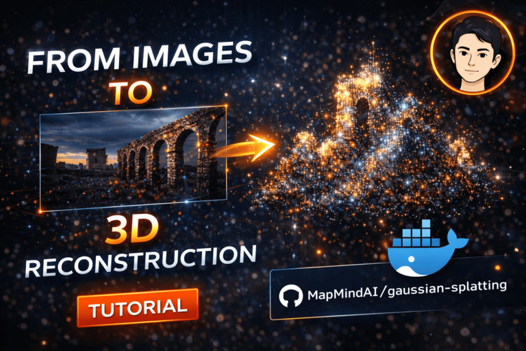
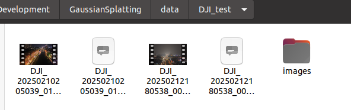
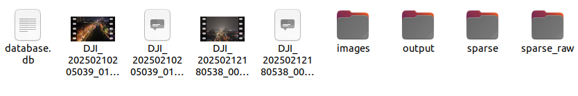

# Readme for MapMindAI


|  video | video |
|-------|--------|
| [](https://www.youtube.com/watch?v=VIDEO_ID) | [](https://www.youtube.com/watch?v=VIDEO_ID) |


# 🚀 Getting Started
## 1. Prepare the environment

We recommend using the provided Docker image to ensure a consistent environment.
`docker pull ghcr.io/mapmindai/gaussiansplatting:latest`

run the container with:
```
docker run -it --rm -v $(pwd):/workspace ghcr.io/MapMindAI/myapp:latest
```

<details>
<summary>Or build the environment if not using docker image</summary>
In the repo we have rebuilt libs for docker env, if you don't use docker, you might need to build these libs:

```
pip install submodules/diff-gaussian-rasterization
pip install submodules/simple-knn
pip install submodules/fused-ssim
```

And exif tools is need, if you want to extract gps from gopro videos.
```
sudo apt update
sudo apt install libimage-exiftool-perl
```
</details>


## 2. Visualization

* 👑 use https://playcanvas.com/supersplat/editor
* 👍 using the threejs version from https://discourse.threejs.org/t/3d-gaussian-splatting-in-three-js/57858 in https://projects.markkellogg.org/threejs/demo_gaussian_splats_3d.php


## 3. Run With Drone Data

1. Put the data to folder ([example google drive drone videos](https://drive.google.com/drive/folders/1TIcNHhN6kdgpAfCDT56L06swd2MmmnuI?usp=drive_link)
):
  * Put the drone video to the session_folder.
  * If you want to build with images, create a folder called "images", and put you photos there.



2. Run the script:

```
./mindmap/run_drone.sh MAP_FOLDER SESSION_NAME
```

Example usage : `./mindmap/run_drone.sh /mnt/data/yeliu/gaussian_splatting DJI_test`.
About 1 hour is needed for the full pipeline.
After the building step finished, we will have the following results in the folder, and gaussian splatting point cloud could be found in 'output' folder:




## 4. Run with 360 data

1. Put the data to folder ([example google drive panorama videos](https://drive.google.com/drive/folders/1goRPlZ7ikPTf-TNwHq7rNClTvoauZEzw?usp=drive_link):
  * Put the 360 video to the session_folder.
  * Gopro Max 360 support GPS output. <u>For gopro max videos, "xxx.360" file is required to obtain the GPS data.</u>
  * Insta360 video needed to be processed into standard panorama videos.

2. Run the script:

```
./mindmap/run_360.sh MAP_FOLDER SESSION_NAME
```

Example usage : `./mindmap/run_gopro.sh /mnt/data/yeliu/gaussian_splatting gopro_test`.
About 4 hour is needed for the full pipeline.
After the building step finished, we will have the following results in the folder, and gaussian splatting point cloud could be found in 'output' folder:

# Adjust Gaussian Parameters

* You could refer to the raw repo, and the build script "mindmap/colmap/gaussian.sh" to adjust your parameters.
* You can move to "run_xxx.sh" to adjust parameter for videos.
