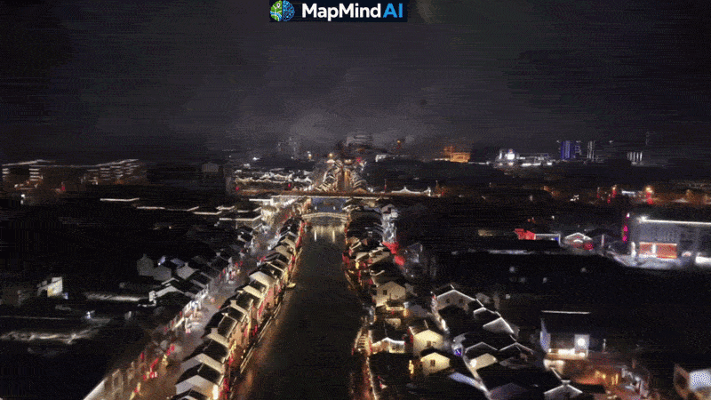

# Readme for MapMindAI

EasyGaussianSplatting provides an end-to-end, production-oriented pipeline for Gaussian Splatting.

|  video bilibili (CN) | video youtube (EN) |
|-------|--------|
| [](https://www.bilibili.com/video/BV1W5DjB1EFr) | [](https://youtu.be/uL9QC6mJdKs) |

The repository is designed to bridge the gap between research prototypes and real-world applications by integrating:

- Docker-based environment for reproducibility
- Automated scripts for the full reconstruction workflow
- One-command execution from input data to final rendering

In addition to the standard pipeline, this project includes **geo-referencing capabilities**:
- Native support for DJI and GoPro datasets with GPS metadata
- Transformation from geographic coordinates to UTM space
- Recovery of metric scale using GPS information
- Integration of geo-aligned reconstruction into the pipeline

We further **optimize the memory footprint** of Gaussian Splatting,
**significantly reducing GPU usage** and enabling large-scale scene training on consumer-grade GPUs.

These features enable users to obtain not only visually accurate reconstructions, but also **spatially consistent, scale-aware, and scalable 3D scenes**.

EasyGaussianSplatting is suitable for:
- Research and benchmarking
- Robotics and mapping applications
- Real-world 3D reconstruction tasks requiring geo-referenced outputs

# 🚀 Getting Started
## 1. Prepare the environment

We recommend using the provided Docker image to ensure a consistent environment.
`docker pull ghcr.io/mapmindai/gaussiansplatting:latest`.

Run the container with:
```
docker run -it --rm -v $(pwd):/workspace ghcr.io/mapmindai/gaussiansplatting:latest
```

<details>
<summary>Or build the environment if not using docker image</summary>

Please refer to the docker file "artifacts/docker/dev.dockerfile" to build the environment.

```
docker build -f artifacts/docker/dev.dockerfile -t colmap_gaussian_splatting artifacts/docker/
```

In the repo we have rebuilt libs for docker env, if you don't use docker, you might need to build these libs:

```
pip install submodules/diff-gaussian-rasterization
pip install submodules/simple-knn
pip install submodules/fused-ssim
```
</details>


## 2. Visualization

* 👑 use https://playcanvas.com/supersplat/editor
* 👍 using the threejs version from https://discourse.threejs.org/t/3d-gaussian-splatting-in-three-js/57858 in https://projects.markkellogg.org/threejs/demo_gaussian_splats_3d.php
* [A webtool](https://yeliu-deepmirror.github.io/Tools/colmap_viewer.html) could be used to visualize colmap result.

## 3. Run With Drone Data

1. **Create the DJI mission**. Use the mission planning tool at https://yeliu-deepmirror.github.io/Tools/dji_mission_customer.html to generate a DJI flight task, then upload the task to the DJI drone and execute the capture.
2. **Collect the captured data.** After the flight, copy all DJI videos and images into a single dataset folder. ([example google drive drone videos](https://drive.google.com/drive/folders/1TIcNHhN6kdgpAfCDT56L06swd2MmmnuI?usp=drive_link), [example 百度云 drone videos](https://pan.baidu.com/s/1cGXAVGgjjHT833OYTxyXMw?pwd=pnmh)):
  * Put the drone video to the session_folder, along with the RST file (used to extract GPS message).
  * If you want to build with images, create a folder called "images", and put you photos there.


3. **Run the reconstruction pipeline**:

```
./mapmind/run_drone.sh MAP_FOLDER SESSION_NAME
```

4. The script will automatically:
  * preprocess videos and subsample frames
  * extract GPS and focus length metadata
  * run COLMAP + GLOMAP mapping
  * align the reconstruction with GPS to recover real-world scale
  * process the scene for Gaussian Splatting

Example usage : `./mapmind/run_drone.sh /mnt/data/yeliu/gaussian_splatting DJI_test`.
About 1 hour is needed for the full pipeline. ([example gs output](https://drive.google.com/file/d/1K8n5lYDqT42_YaPtC5t4T2Nx0TkEyDko/view?usp=drive_link))
After the building step finished, we will have the following results in the folder, and gaussian splatting point cloud could be found in 'output' folder:




## 4. Run with 360 data

1. **Capture the videos**. Record 360 videos using either GoPro Max or Insta360.
  * GoPro Max has built-in GPS.
  * Insta360 requires **connection to a phone** to include GPS, since GPS is obtained from the phone.
2. **Prepare the panorama files**

| GoPro Max|  Insta360 |
|------------|--------|
| Use the official GoPro application to stitch the raw video into a standard panorama video. <br>For each capture, keep both: <br>* the raw .360 file; <br>* the stitched .mp4 panorama video; <br>Both files should be uploaded into the dataset folder. | Copy the raw .insv file directly from the SD card. <br>No manual stitching is required. <u>High-quality stitching is included in our Docker pipeline.</u> |
| ([example google drive panorama videos](https://drive.google.com/drive/folders/1goRPlZ7ikPTf-TNwHq7rNClTvoauZEzw?usp=drive_link), [example 百度云 drone videos](https://pan.baidu.com/s/13rb8IkgxRQ2M-nywWnyKfw?pwd=n176)) |  |

<details>
<summary>Insta360 stitch with Linux SDK</summary>

Raw Insta360 videos need to be processed with phone, and lack of parameters. Here we use sdk for linux cuda, so we could process the video fast and accurate.
[Desktop-MediaSDK-Cpp](https://github.com/Insta360Develop/Desktop-MediaSDK-Cpp), example command:


```bash
export LD_LIBRARY_PATH=$LD_LIBRARY_PATH:/usr/local/lib
INPUT_INSV=data/insta360_test/VID_20260417_141937_00_001.insv
OUPUT_VIDEO=data/insta360_test/VID_20260417_141937_00_001_test.mp4

insta360_media_stitcher \
-inputs ${INPUT_INSV} \
-output ${OUPUT_VIDEO} \
-model_root_dir /EasyGaussianSplatting/data/sdk_dir \
-stitch_type aistitch -enable_stitchfusion \
-output_size 8000x4000 -bitrate 150000000 \
-enable_h265_encoder -enable_flowstate -enable_colorplus
```

Insta360 IMU and GPS are all available from its exif file, refer to "mapmind/panorama/insta360_meta_extractor.py" to see more details, about how we extract these data.

</details>


3. **Run the reconstruction pipeline**:

```
./mapmind/run_360.sh MAP_FOLDER SESSION_NAME
```

4. The script will automatically:
  * video preprocessing & panorama-to-pinhole extraction (high-quality stitching for Insta360 when needed)
  * extract GPS and focus length metadata
  * run COLMAP + GLOMAP mapping
  * align the reconstruction with GPS to recover real-world scale
  * process the scene for Gaussian Splatting
  * localization asset generation, including depth, TSDF mesh, and localization database, for [localization service](https://github.com/MapMindAI/VisualLocalizationService)

Example usage : `./mapmind/run_360.sh /mnt/data/yeliu/gaussian_splatting insta360_test`.
About 4 hour is needed for the full pipeline. ([example gs output](https://drive.google.com/file/d/1OjUJQPisnMGFPAohGS6qwURQP-gvanrW/view?usp=drive_link))
After the building step finished, we will have the following results in the folder, and gaussian splatting point cloud could be found in 'output' folder.

# Adjust Gaussian Parameters

* You could refer to the [raw repo readme](README_gaussian_splatting.md), and the build script "mapmind/colmap/gaussian.sh" to adjust your parameters.
* You can move to "run_xxx.sh" to adjust parameter for videos.

# [FAQ](FAQ.md)
